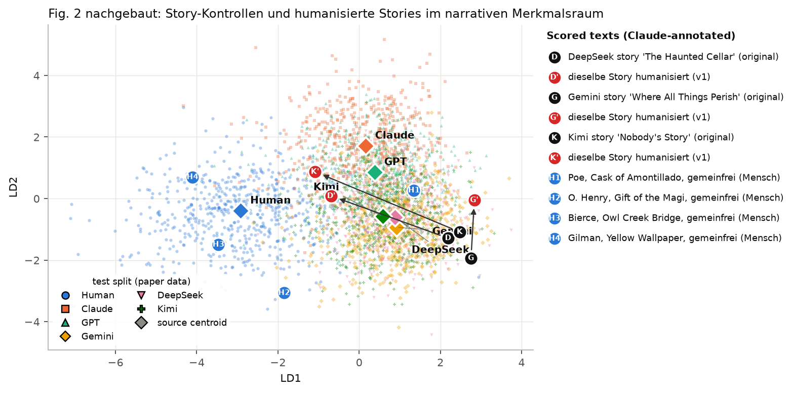
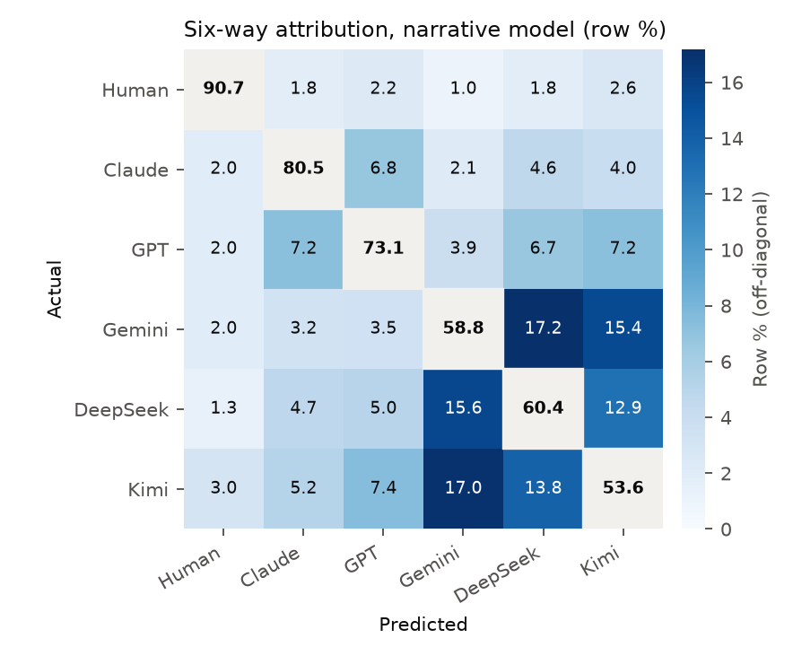
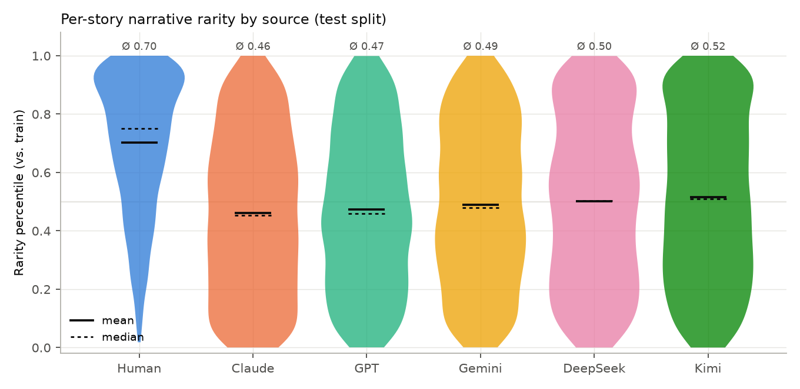
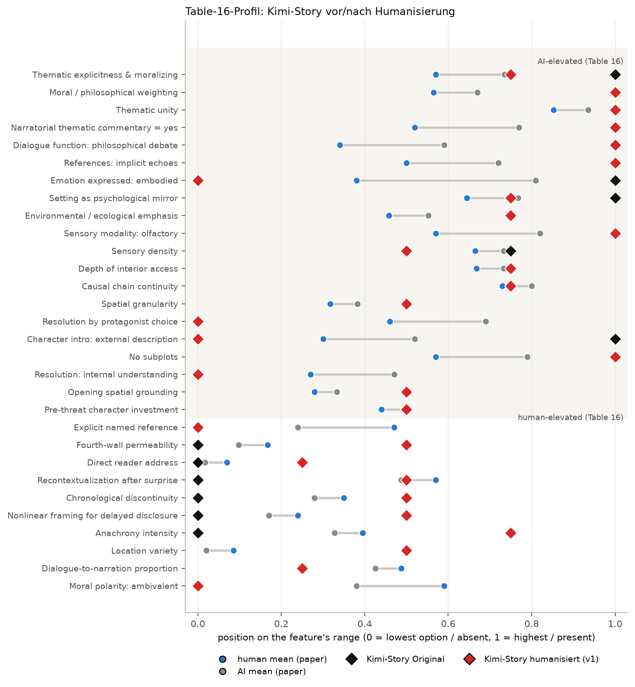
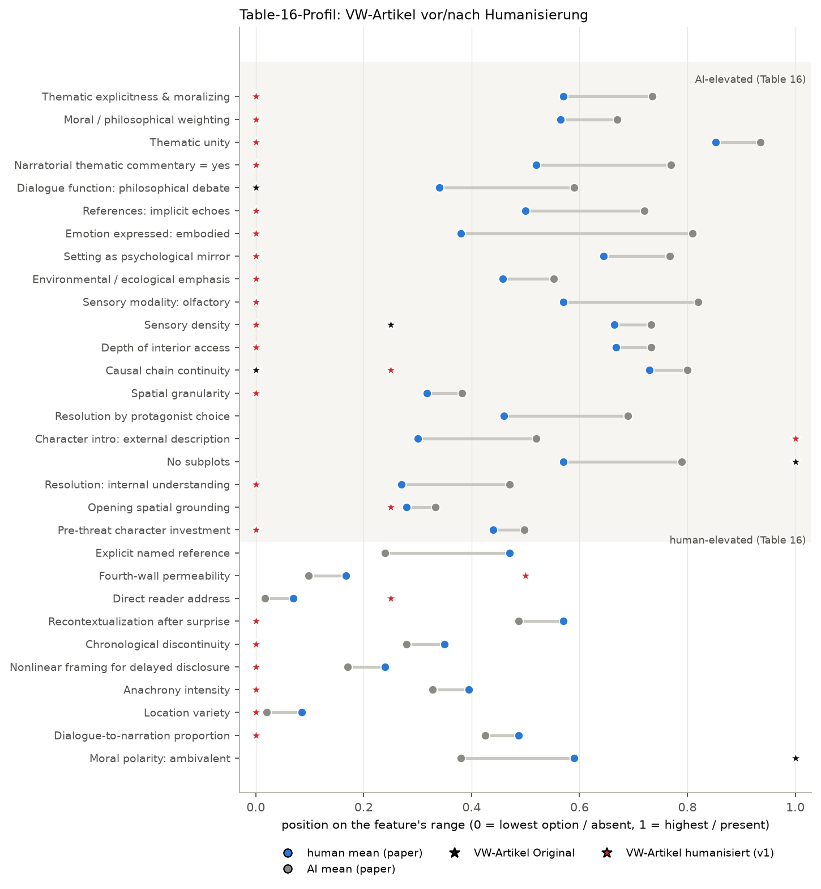
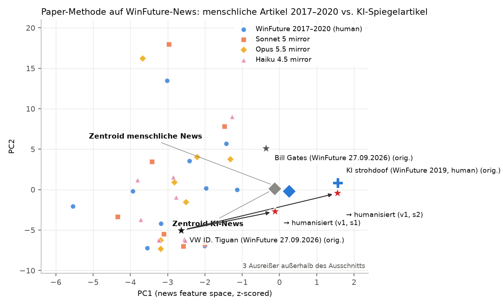

# Humanisierungs-Prompt nach StoryScope: Messung, Test, Ergebnis

Stand: 2026-09-27. Grundlage: Russell, Rajendhran, Pham, Iyyer, Wieting: *StoryScope: Investigating idiosyncrasies in AI fiction*, COLM 2026 (arXiv 2604.03136), Code und Daten unter github.com/jenna-russell/storyscope.

## 1. Was das Paper misst

Das Paper trennt menschliche von KI-Texten **nicht über Stil** (Wortwahl, Satzbau, Gedankenstriche), sondern über **narrative Entscheidungen**: 304 Merkmale in zehn Dimensionen (Figuren, soziales Netz, Ereignisse, Plot, Struktur, Setting, Zeit, Enthüllung, Perspektive, Stil), automatisch aus 600 Vergleichsanalysen abgeleitet und dann per LLM (Gemini 3 Flash) für 61.608 Texte vergeben. Ein XGBoost-Klassifikator auf diesen Merkmalen erreicht ohne jedes Stilmerkmal 93,2 % Macro-F1 (Mensch vs. KI) und 68,4 % bei der Sechs-Wege-Zuordnung (Mensch, Claude, GPT, Gemini, DeepSeek, Kimi). 30 „Core-Features" tragen den Großteil des Signals (Table 16 des Papers). KI-Texte erklären ihre Themen, sind kausal aufgeräumt und linear, zeigen Gefühle über Körper und Kulisse; menschliche Texte springen in der Zeit, nennen konkrete Referenzen, sprechen den Leser an, lassen Fäden offen und bleiben moralisch ambivalent.

Die drei Abbildungen des Papers, die ich nachgebaut habe: Fig. 2 (LDA-Projektion des Merkmalsraums, Menschen als eigener Cluster), Fig. 3 (Konfusionsmatrix der Sechs-Wege-Zuordnung), Fig. 5 (Seltenheits-Perzentile je Quelle). Dazu die Table-16-Profile als eigene Grafik.

## 2. Nachbau der Messung

- Daten: das veröffentlichte `storyscope_features.parquet` (61.575 Texte × 304 Merkmale, inklusive der menschlichen Texte), `taxonomy.json`, Prompts aus dem Repo.
- Kodierung wie im Paper (§3): nominal → One-Hot, Multi-Select → Multi-Hot, ordinal/skalar → numerisch. Stil-Dimension (39) plus 8 stilabhängige Merkmale ausgeschlossen (Audit mit drei unabhängigen Bewertern nach der Regel aus Anhang B) → 257 narrative Merkmale, 746 kodierte Spalten.
- Klassifikator: XGBoost mit den Hyperparametern des Papers (binär 420 Bäume/Tiefe 8/λ 2/5:1-Gewicht; sechsfach 500/7/1), Split nach Prompt (GroupKFold, 49.032 Train / 12.264 Test).

| Messgröße | Paper | Nachbau |
|---|---|---|
| Mensch vs. KI, narrativ, Macro-F1 | 93,2 | 94,1 |
| Mensch vs. KI, narrativ + Stil, Macro-F1 | 96,0 | 95,9 |
| Sechs-Wege, narrativ, Macro-F1 | 68,4 | 69,5 |
| Sechs-Wege, narrativ + Stil, Macro-F1 | 77,3 | 77,5 |
| Per-Klasse F1 narrativ (Mensch/Claude/GPT/Gemini/DeepSeek/Kimi) | .89/.77/.73/.60/.57/.55 | .90/.79/.74/.59/.59/.55 |
| Seltenheit, mittleres Perzentil Mensch vs. KI | 0,71 / 0,49 | 0,70 / 0,49 |
| Zentroid-Abstand Mensch–KI vs. KI–KI | 6,6 / 4,3 | 6,4 / 3,9 |

Die Merkmalsvergabe für neue Texte läuft mit dem unveränderten Zehn-Dimensionen-Prompt aus `apply_features.py`, als Annotator Claude Sonnet 5 statt Gemini 3 Flash (kein Google-Zugang in dieser Umgebung). Wiederholbarkeit über drei Läufe: 78–87 % exakte Übereinstimmung je Merkmal (Paper: 89 % paarweise mit Gemini Flash). Übereinstimmung Claude ↔ Gemini auf denselben drei Dev-Stories: 64–67 %.

Validierung des Annotators im Zielbereich des Papers (englische Kurzgeschichten): drei KI-Stories aus dem Dev-Set (Gemini, DeepSeek, Kimi) → P(Mensch) 0,000–0,002; vier gemeinfreie menschliche Erzählungen (O. Henry, Gilman, Bierce, Poe) → P(Mensch) 0,98–1,00. Der Klassifikator funktioniert mit Claude als Annotator also im Paper-Bereich fehlerfrei auf diesen Kontrollen. **Nicht übertragbar ist das Seltenheitsmaß** (Fig. 5): Claude-annotierte Vektoren liegen systematisch abseits der Gemini-annotierten Verteilung (Perzentil 1,00 für jeden neuen Text), deshalb wird die Seltenheit nur als Reproduktion aus den Paper-Daten gezeigt, nicht für neue Texte.

## 3. Der VW-Artikel im Paper-Instrument: Domänenproblem statt Antwort

Der Artikel „VW ID. Tiguan: Premiere im Oktober beendet die ID.4-Ära" (426 Wörter, deutsch, Nachricht) liegt weit außerhalb dessen, wofür die 304 Merkmale gebaut sind (englische Erzählungen, ~5.000 Wörter). Auf 24 der 30 Core-Features steht er auf dem niedrigsten Wert oder „nicht vorhanden" (kein Protagonist, keine Enthüllung, keine Zeitstruktur). Der Klassifikator sagt trotzdem etwas, und genau das ist das Problem:

| Text | P(Mensch) narrativ | Sechs-Wege (narrativ) |
|---|---|---|
| VW ID. Tiguan (27.09.2026), drei Annotationsläufe | 0,02 / 0,00 / 0,02 | Kimi 0,75 / 0,75 / 0,66 |
| Bill Gates (27.09.2026, gleiche Autorin, gleicher Tag) | 0,69 | Kimi 0,69 |
| „KI strohdoof" (24.10.2019, drei Jahre vor ChatGPT, sicher Mensch) | 0,09 | DeepSeek 0,70 |

Die sichere menschliche Kontrolle von 2019 bekommt dasselbe Urteil wie der VW-Artikel. Ein Instrument, das den Menschen nicht erkennt, kann den Verdachtsfall nicht belasten. **Die Sechs-Wege-Zuordnung („Kimi" bzw. „DeepSeek") ist für diese Textsorte ohne Aussagekraft** und darf nicht als Antwort auf die Frage „mit welcher KI" gelesen werden: sie ordnet auch den 2019er Text einem Modell zu, das es damals nicht gab.

## 4. Die Paper-Methode auf WinFuture-News übertragen

Weil das Paper selbst mit einem Parallelkorpus arbeitet (derselbe Prompt, einmal Mensch, einmal Modell), habe ich das für News nachgestellt: 15 WinFuture-Artikel von 2017–2020 (vier Autor:innen, 239–403 Wörter, alle vor ChatGPT), je Artikel ein rückwärts extrahiertes Fakten-Briefing (Analogon zu Figure 6 des Papers) und daraus je zwei KI-Spiegelartikel von Claude Sonnet 5, Opus 5.5 und Haiku 4.5 (30 KI-Texte, 181–398 Wörter). Alle 45 Texte mit denselben 304 Merkmalen annotiert, dann geprüft, ob irgendein Merkmalssatz Mensch von KI trennt (logistische Regression, 5-fach-Kreuzvalidierung, zehnfach wiederholt, Permutationstest mit 60 Umordnungen):

| Merkmalssatz | Spalten | CV-AUC | Permutations-Nullwert | p |
|---|---|---|---|---|
| narrativ (257) | 454 | 0,29 | 0,50 ± 0,12 | 0,95 |
| alle 304 | 515 | 0,46 | 0,51 ± 0,10 | 0,75 |
| nur Stil (39) | 53 | 0,62 | 0,53 ± 0,13 | 0,30 |
| Core-30 | 44 | 0,36 | 0,48 ± 0,13 | 0,85 |

Kein Satz trennt besser als Zufall; menschliche und KI-News liegen im Merkmalsraum ineinander (Abbildung „news_space", die beiden Zentroiden fallen praktisch zusammen). Ein Effekt mittlerer Größe wäre mit 45 Texten sichtbar geworden; ein kleiner nicht. **Folgerung: Für kurze deutsche Nachrichtentexte hat das Paper-Instrument keine Trennschärfe.** Was das Paper über KI-Erzählungen sagt (Erklären des Themas, Linearität, verkörperte Gefühle), ist im Nachrichtenformat entweder Konvention für beide Seiten oder nicht vorhanden.

## 5. Der Prompt und sein Test im Paper-Bereich

Der Prompt (`prompts/humanize_vN.md`) ist direkt aus Table 16 und § 4.1 des Papers abgeleitet: Er verbietet neue Fakten, erhält alle Fakten, und ordnet dann sieben Eingriffsgruppen nach ihrer SHAP-Wichtigkeit an: (A) nicht mehr erklären, was der Text bedeutet; (B) die Zeitachse brechen und einen Fakt zurückhalten; (C) Nebengleis, offene Fäden, kein Fazit; (D) Personen über Rede/Handlung statt Beschreibung einführen, Quellen beim Namen nennen, mehr direkte Rede; (E) Leseransprache; (F) Gefühle benennen statt verkörpern, keine Gerüche und Kulissen als Stimmungsspiegel; (G) Orte nennen, nicht ausmalen. Dazu eine Selbstprüfliste.

**Testprotokoll.** Rewriter: Claude Opus 5.5. Jede Umschrift wird (1) von einem Faktenprüfer (Opus 5.5, strukturierte Ausgabe) gegen das Original geprüft – erfundene, veränderte, weggelassene Fakten; bei Erzählungen zählen nur Handlung, Figuren, Orte, Ausgang, nicht Moral oder Kommentar –, (2) mit dem Zehn-Dimensionen-Prompt neu annotiert und (3) durch den nachgebauten Klassifikator geschickt. Erfolg = P(Mensch) ≥ 0,5 im narrativen Modell bei Faktentreue 100.

**Ergebnis v1 (Paper-Bereich, drei KI-Stories aus dem Dev-Set):**

| Story | P(Mensch) vorher | nachher v1 | Logit nachher | Faktentreue |
|---|---|---|---|---|
| Kimi K2.5, „Nobody's Story" (1.804 → 1.546 Wörter) | 0,000 | **0,978** | +3,8 | 100 |
| DeepSeek V3.2, „The Haunted Cellar" (1.805 → 1.673) | 0,000 | **0,991** | +4,7 | 100 |
| Gemini 3 Flash, „Where All Things Perish" (1.839 → 1.702) | 0,000 | 0,000 | −10,3 | 100 |

Zwei von drei Stories wandern mit v1 in den menschlichen Bereich des Merkmalsraums (Abbildung `fig2_lda_overlay_fiction.png`: K→K', D→D'), die Gemini-Story bleibt bei einem Logit von −10 stehen, obwohl 73 der 304 Merkmale sich geändert haben. Die SHAP-Diagnose der nach v1 weiter „KI"-wertigen Merkmale (aggregiert über alle Texte) nennt: Bogen-Vollständigkeit (Cliffhanger statt geschlossenem oder offenem Ende), Ereignis-Neuheit, Zwillingsplatzierung der Wendung, Dialoganteil, thematische Einheit 5, thematische Explizitheit 4, keine Rekontextualisierung nach der Überraschung, keine benannten Referenzen, weiterhin alle fünf Sinne inklusive Geruch. Diese Liste war der Input für v2.

**Messrauschen.** Die Annotation ist selbst eine LLM-Messung. Dieselbe humanisierte Kimi-Story dreimal annotiert ergab P(Mensch) 0,98 / 0,89 / 0,21. Nahe der Entscheidungsgrenze kann ein einzelner Annotationslauf das Urteil kippen; die Originale sind davon nicht betroffen (Logit −10 bis −14, P(Mensch) bleibt 0,000). Deshalb gilt für die Endabnahme einer Prompt-Version: drei Annotationsläufe je Umschrift, Kriterium ist der Mittelwert.

**v2 (Panel-Vorschlag, 2.700 Wörter).** Drei unabhängige Vorschlagsrunden auf Basis der v1-Diagnose plus eine Synthese ergaben v2: verschärfte Faktenregel (Wissensstand, Gewissheitsgrad), Enthüllung ins letzte Fünftel, Nachspiel höchstens ein Absatz, keine Ankündigungen, Repliken zählen, Geruch/Geschmack null, Einstieg „nie am Ende", keine neuen Zeitangaben. Ergebnis mit je drei Annotationsläufen: Gemini-Story 0,77 / 0,00 / 0,03 (Mittel 0,27, vorher 0,00), Kimi-Story 0,05 / 0,00 / 0,08 (Mittel 0,04, mit v1: 0,69). Der VW-Artikel: Faktentreue 100 bei beiden Proben (die Faktenregel wirkt), P(Mensch) 0,02–0,03 (im Nachrichtenbereich ohne Aussagekraft, siehe § 4).

Die Feature-Diagnose erklärt den Rückschritt bei Kimi exakt: v2 hatte die Zeitachse wieder geradegebogen. Chronologische Diskontinuität 3 → 1, Anachronie 4 → 1, keine Rückblenden mehr, Vorgeschichte vorn, Gefühle wieder verkörpert statt benannt (v2 hatte „erlebte Rede" verlangt, das Modell lieferte Körperreaktionen). Genau die menschlich erhöhten Zeit-Merkmale aus Table 16 waren verloren gegangen, weil v2 den Einstieg am Ende, Zeitangaben und den Rückblick-Rahmen verboten hatte. Bei Gemini halfen dagegen drei v2-Regeln messbar: Hauptfigur spricht vor ihrer Beschreibung (+3,2 Logit), thematische Explizitheit 4 → 3 (+1,5), keine Selbstkommentierung am Ende (+0,6).

**v3** nimmt v1 als Basis (die Zeitachsen-Regeln bleiben, verstärkt auf zwei Zeitsprünge, Rückblenden erwünscht) und übernimmt aus v2 nur, was nachweislich half: Faktenregel, Hauptfigur spricht zuerst, keine Eigenschaftsetiketten, höchstens ein erklärender Erzählersatz und keiner am Ende, Nachspiel ein Absatz, Enthüllung im letzten Fünftel, Geruch/Geschmack null, benannte Gefühle ohne Umweg über erlebte Rede.

## 6. Ergebnis über alle Prompt-Versionen

Messung: nachgebauter StoryScope-Klassifikator (narrativ, 257 Merkmale), P(Mensch) als Mittelwert über drei Annotationsläufe je Umschrift (Originale: ein Lauf, weil Logit ≪ 0). Faktentreue vom Faktenprüfer (100 = nichts erfunden, verändert, weggelassen). Rewriter: Claude Opus 5.5, eine Probe je Text.

**Überblick Paper-Bereich (drei KI-Stories, P(Mensch) narrativ, Mittel über Annotationsläufe):**

| Version | DeepSeek-Story | Gemini-Story | Kimi-Story | Mittel | bestanden (≥0,5) |
|---|---|---|---|---|---|
| original | 0.0 | 0.0 | 0.0 | 0.0 | 0.0 |
| v1 | 0.99 | 0.0 | 0.69 | 0.56 | 2.0 |
| v2 | 0.82 | 0.27 | 0.04 | 0.38 | 1.0 |
| v3 | 0.48 | 0.25 | 0.33 | 0.35 | 0.0 |
| v4 | 1.0 | 0.03 | 0.17 | 0.4 | 1.0 |

**Alle Messungen:**

| Text | Version | Probe | Annot.-Läufe | P(Mensch) Mittel | min–max | Faktentreue | Wörter |
|---|---|---|---|---|---|---|---|
| DeepSeek-Story | original | – | 1 | **0.00** | 0.00–0.00 |  |  |
| DeepSeek-Story | v1 | 1 | 3 | **0.99** | 0.98–0.99 | 100 | 1673 |
| DeepSeek-Story | v2 | 1 | 3 | **0.82** | 0.78–0.88 | 90 | 1574 |
| DeepSeek-Story | v3 | 1 | 3 | **0.48** | 0.21–0.99 | 90 | 1593 |
| DeepSeek-Story | v4 | 1 | 3 | **1.00** | 0.99–1.00 | 100 | 1508 |
| Gemini-Story | original | – | 1 | **0.00** | 0.00–0.00 |  |  |
| Gemini-Story | v1 | 1 | 1 | **0.00** | 0.00–0.00 | 100 | 1702 |
| Gemini-Story | v2 | 1 | 3 | **0.27** | 0.00–0.77 | 100 | 1547 |
| Gemini-Story | v3 | 1 | 3 | **0.25** | 0.15–0.41 | 100 | 1488 |
| Gemini-Story | v4 | 1 | 3 | **0.03** | 0.00–0.10 | 100 | 1504 |
| Kimi-Story | original | – | 1 | **0.00** | 0.00–0.00 |  |  |
| Kimi-Story | v1 | 1 | 3 | **0.69** | 0.21–0.98 | 100 | 1546 |
| Kimi-Story | v2 | 1 | 3 | **0.04** | 0.00–0.08 | 90 | 1450 |
| Kimi-Story | v3 | 1 | 3 | **0.33** | 0.07–0.78 | 90 | 1451 |
| Kimi-Story | v4 | 1 | 3 | **0.17** | 0.08–0.34 | 100 | 1650 |
| KI-Spiegel-News (Sonnet) | v2 | 1 | 1 | **0.65** | 0.65–0.65 | 100 | 254 |
| KI-Spiegel-News (Opus) | v2 | 1 | 1 | **0.43** | 0.43–0.43 | 100 | 300 |
| VW ID. Tiguan (News) | original | – | 3 | **0.02** | 0.00–0.02 |  |  |
| VW ID. Tiguan (News) | v1 | 1 | 1 | **0.10** | 0.10–0.10 | 75 | 391 |
| VW ID. Tiguan (News) | v1 | 2 | 1 | **0.02** | 0.02–0.02 | 85 | 397 |
| VW ID. Tiguan (News) | v2 | 1 | 1 | **0.03** | 0.03–0.03 | 100 | 415 |
| VW ID. Tiguan (News) | v2 | 2 | 1 | **0.02** | 0.02–0.02 | 100 | 414 |
| VW ID. Tiguan (News) | v3 | 1 | 1 | **0.04** | 0.04–0.04 | 100 | 409 |
| VW ID. Tiguan (News) | v3 | 2 | 1 | **0.04** | 0.04–0.04 | 100 | 398 |
| VW ID. Tiguan (News) | v4 | 1 | 1 | **0.03** | 0.03–0.03 | 100 | 440 |
| VW ID. Tiguan (News) | v4 | 2 | 1 | **0.10** | 0.10–0.10 | 100 | 421 |
| Bill Gates (News) | original | – | 1 | **0.69** | 0.69–0.69 |  |  |
| Bill Gates (News) | v2 | 1 | 1 | **0.92** | 0.92–0.92 | 100 | 451 |
| Bill Gates (News) | v3 | 1 | 1 | **0.38** | 0.38–0.38 | 90 | 440 |
| Bill Gates (News) | v4 | 1 | 1 | **0.61** | 0.61–0.61 | 100 | 455 |

Lesart:
- **v1 ist die beste Version im Paper-Bereich:** zwei von drei KI-Stories werden vom Klassifikator als menschlich eingestuft (DeepSeek 0,99 stabil über drei Läufe; Kimi 0,69 mit Streuung 0,21–0,98), die dritte (Gemini) bleibt bei 0,00. Jede längere, stärker vorschreibende Version (v2, v3) hat die Gemini-Story verbessert (Logit −10 → −1 bis −3), aber die beiden anderen verschlechtert, weil der Rewriter die entscheidenden Zeitachsen-Eingriffe zugunsten der vielen Zusatzregeln fallen ließ.
- v4 = v1 plus vier belegte Ergänzungen (Faktenregel für Wissensstand und Gewissheitsgrad, Enthüllung ins letzte Fünftel, Nachspiel höchstens ein Absatz, Geruch/Geschmack null, Zitatregel für News). Ergebnis v4 (je drei Annotationsläufe): DeepSeek 1,00, Kimi 0,17, Gemini 0,03, Mittel 0,40, eine von drei bestanden; Faktentreue 100 bei allen fünf Texten. Die Strukturzusätze haben also wieder gekostet, was sie bei Gemini bringen sollten, ohne es dort zu bringen.
- Die Faktentreue ist seit v2 bei Nachrichtentexten 100 (v1: 75/85 wegen erfundener „nicht bekannt"-Sätze); die schärfere Faktenregel ist in v4 enthalten.
- Für den VW-Artikel bleibt P(Mensch) unter allen Versionen bei 0,02–0,10. Das ist kein Scheitern des Prompts, sondern die fehlende Trennschärfe des Instruments für Nachrichtentexte (§ 3–4): auch der menschliche Kontrolltext bekommt 0,09. Die Umschriften des VW-Artikels (`results/rewrites/`) sind fakten­treu (100) und lesen sich als Nachricht; ob sie „menschlicher" sind, kann dieses Instrument nicht sagen.

**Empfehlung für die Redaktion:** `prompts/humanize_final.md` verwenden. Das ist der Strukturteil von v1 unverändert (die beste gemessene Version) plus die Faktenregeln aus v2–v4 (Wissensstand, Gewissheitsgrad, Zitatregel für News, zwei Prüfpunkte), die nur die Faktentreue betreffen und dort in allen Läufen 100 erreicht haben. Diese Kombination selbst wurde nicht noch einmal als Ganzes durchgemessen; ihr Strukturteil ist identisch mit v1. Weil das Urteil des Klassifikators nahe der Grenze streut, lohnt sich bei Erzähltexten ein Auswahlschritt: zwei bis drei Umschriften erzeugen, jede dreimal annotieren, die mit dem höchsten Mittelwert nehmen (`ss_humanize.py --samples 3 --annot-runs 3`). Bei Nachrichtentexten ist der einzige harte, messbare Maßstab die Faktentreue; dort ist der Prompt vor allem ein Struktur-Werkzeug (Einstieg, Reihenfolge, Zitate, Leseransprache) und kein Detektor-Umgeher.

## Abbildungen (wie im Paper)

| Datei | Entspricht | Inhalt |
|---|---|---|
| `results/figs/fig2_lda_repro.png` | Fig. 2 | LDA-Projektion des narrativen Merkmalsraums, Test-Split der Paper-Daten, sechs Quellen mit Zentroiden |
| `results/figs/fig2_lda_overlay_fiction.png` | Fig. 2 + Overlay | dieselbe Projektion mit den vier menschlichen Kontroll-Erzählungen (H1–H4), den drei KI-Stories (D, G, K) und ihren v1-Umschriften (D', G', K') |
| `results/figs/fig3_confusion_repro.png` | Fig. 3 | Konfusionsmatrix der Sechs-Wege-Zuordnung (narratives Modell, Zeilen-%) |
| `results/figs/fig5_rarity_repro.png` | Fig. 5 | Seltenheits-Perzentile je Quelle (nur Paper-Daten, s. Messrauschen) |
| `results/figs/fig_core_profile_vw.png` | Table 16 | die 30 Core-Features: VW-Artikel vor/nach Humanisierung gegen die Mittelwerte Mensch/KI |
| `results/figs/fig_core_profile_kimi.png` | Table 16 | dasselbe für die Kimi-Story (die erfolgreiche v1-Umschrift) |
| `results/figs/fig_news_space.png` | eigene | News-Spiegelkorpus: menschliche WinFuture-Artikel vs. KI-Spiegel, VW-Artikel und Umschriften darin |








## 7. Mit welcher KI wurde der VW-Artikel geschrieben?

Ehrliche Antwort aus dieser Messung: **nicht bestimmbar.** Drei Gründe, jeder für sich ausreichend:

1. Die Sechs-Wege-Zuordnung des Papers kennt nur Claude Sonnet 4.6, GPT-5.4, Gemini 3 Flash, DeepSeek V3.2, Kimi K2.5 und Mensch, jeweils als Autor englischer Kurzgeschichten. Für einen deutschen Nachrichtentext liefert sie „Kimi" (0,66–0,75) – und für den sicher menschlichen WinFuture-Text von 2019 „DeepSeek" (0,70). Ein Verfahren, das den Menschen von 2019 einem Modell von 2026 zuordnet, hat für diese Textsorte keine Zuordnungskraft.
2. Der eigens gebaute News-Spiegelkorpus zeigt, dass die 304 Merkmale menschliche WinFuture-News nicht von Claude-geschriebenen Spiegelartikeln trennen (CV-AUC 0,29–0,62, Permutationstest nicht signifikant). Wenn Mensch vs. KI nicht trennbar ist, ist Modell vs. Modell erst recht nicht trennbar.
3. Ein Modell-Fingerabdruck im Sinne des Papers (Table 17: Claude = flache Eskalation und Epiloge, GPT = Klatsch als Plotmechanik, Gemini = expandierende Sozialnetze, DeepSeek = sichtbarer Erzähler, Kimi = Einstieg in Aktion) setzt Erzählstruktur voraus, die ein 400-Wörter-Nachrichtentext nicht hat.

Was sich mit dem Paper-Instrument sagen lässt: Der Artikel unterscheidet sich in den 304 narrativen Merkmalen nicht messbar von einem menschlichen WinFuture-Artikel der Vor-ChatGPT-Zeit. Ob er von einer KI stammt, müsste man mit einem stilometrischen Detektor (die Text-Baselines des Papers, 99,7–99,9 % auf Erzählungen) oder mit Redaktionswissen klären, nicht mit narrativen Merkmalen. Das ist kein Nebenbefund, sondern deckt sich mit der Einschränkung im Paper selbst: Die Merkmale brauchen lange Texte („~5,000 words, enabling extraction of fine-grained narrative features that shorter texts cannot support").

## 8. Reproduktion

Alles liegt in `humanizer/`:

```
prompts/humanize_v1.md … humanize_vN.md   die Prompt-Versionen (die letzte ist die empfohlene)
scripts/ss_lib.py                          Taxonomie, Kodierung (paper-treu), Normalisierung wie im Repo
scripts/ss_train.py                        Klassifikator + LDA + Seltenheit auf den Paper-Daten
scripts/ss_annotate.py                     Zehn-Dimensionen-Annotation per `claude -p` + Scorer
scripts/ss_humanize.py                     Umschrift + Faktenprüfung + Annotation + Bewertung
scripts/diagnose.py, build_diag.py         SHAP-Diagnose je Text, Aggregation je Prompt-Version
scripts/gen_ai_news.py, news_domain.py     News-Spiegelkorpus und Domänentest
scripts/ss_plots.py, evaluate_all.py       Abbildungen und Ergebnistabelle
scripts/prompt_panel.js                    Workflow: drei Vorschläge + Synthese für die nächste Version
results/                                   Metriken, Ergebnistabelle, Abbildungen, alle Umschriften
```

Ablauf für einen neuen Text: `python3 scripts/ss_humanize.py prompts/humanize_vN.md text.txt out/ --samples 2` (setzt `claude` CLI voraus; Modelle über `--rewriter`, Annotator über `SS_ANNOT_MODEL`). Voraussetzung einmalig: `git clone https://github.com/jenna-russell/storyscope` nach `/home/user/jenna-russell/storyscope` (oder Pfad in `ss_lib.py` anpassen) und `python3 scripts/ss_train.py --variant narrative --exclude scripts/style_flagged_8.json --out scripts/out_narrative`. Kosten: eine Annotation kostet etwa 0,6–1,1 US-Dollar (10 Aufrufe Sonnet 5), eine Umschrift mit Opus 5.5 etwa 1–3 US-Dollar.
